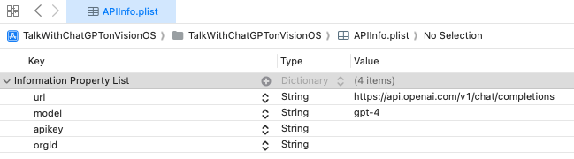

# Talk With CahtGPT on VisionOS
ChatGPTと話せるアプリ

[TalkWithChatGPT](https://github.com/cranoo3/TalkWithChatGPT)のVisionOS版です。

# アプリの仕様
テキストフィールドに入力されたテキストを送信し、ChatGPTからレスポンスを受け取るアプリ

## 動作

 - TextFieldの文字列を送信
 - OpenAIのAPIを仕様し、リクエストを送信する
 - レスポンスを表示する

## 短い文章

## 長い文章

- 自動で一番下までスクロールされる
- ScrollViewになっているのでスクロールできる

# 開発環境

|環境 | バージョン|
|---|---|
| PC | MacBook Pro M3Pro 36GB RAM |
| OS | MacOS Sonoma 14.1 | 
| IDE | Xode 15.2 beta|
| Swift | Swift5.9 |
| interface | SwiftUI |
| ターゲットOS | VisionOS 1.0 |
| GPT | GPT 4(変更可能) |

## GPTバージョンやAPIKey、Organization IDについて

- API Key、Organization IDはOpenAIのサイトから取得してください
- 取得方法は[こちらのサイト](https://note.com/libproc/n/nc777ee0b3bf0)を参考にしました([参考にしたサイト等](#参考にしたサイト等)にも記載しています)
- 取得したAPI KeyやOrganization IDは`APIInfo.plist`に貼り付けてください
- GPTバージョンを変更したい場合は`model`の`Value`を変更してください。
- 使用可能なモデルは[OpenAIのドキュメント](https://platform.openai.com/docs/models/overview)に記載があります。

  

## 今後の改善ポイント
- チャット履歴の保存
- チャットを複数立てれるようにする
- ChatGPTからのレスポンスがMarkdown形式で届くので正しく表示できるようにする
- コードの可読性向上

# 参考にしたサイト等
これらのサイトや今までの課題アプリを参考に作成しました!

- [【Swift】swiftからChatGPT APIを使ってみる](https://thwork.net/2023/04/08/swift_chatgpt-api/)

- [[超初心者向け] ChatGPT(OpenAI)のAPI key取得手順](https://note.com/libproc/n/nc777ee0b3bf0)

- [OpenAI developer platform](https://platform.openai.com/docs/overview)

- [Models](https://platform.openai.com/docs/models/overview)

- [ChatGPTのOpenAI APIを初回実行した際出会ったエラー3点](https://zenn.dev/mjxo/articles/342adeec61d56e)

- [ChatGPT APIをSwiftで使ってみる。](https://qiita.com/district_13_bm/items/c946e8043e0e4d55d349)
